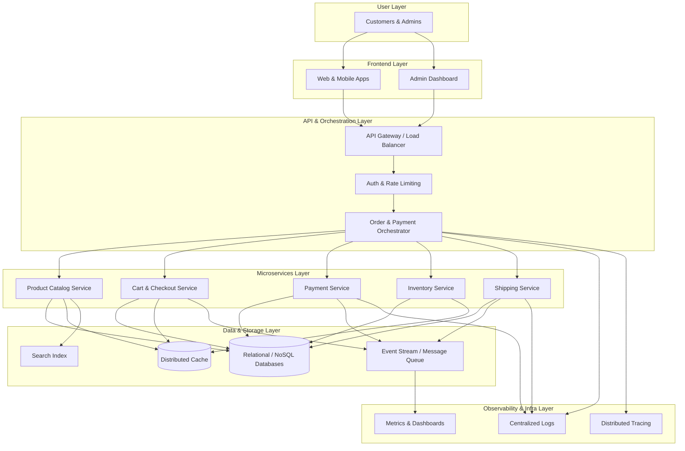

<div align="center">

<!-- ANIMATED HEADER -->


<p align="center">
  🌐 <a href="https://bikashmainali.com.np">Website</a>&nbsp;  &nbsp;  
  💼 <a href="https://www.linkedin.com/in/bikashmainali18/">LinkedIn</a> &nbsp;   &nbsp; 
  📧 <a href="mailto:bikashmainali18@gmail.com">Email</a>&nbsp; &nbsp; 
</p>

<!-- TYPING ANIMATION -->
<a href="https://git.io/typing-svg">

  
</a>
<br/>
<br/>
<br/>
<p>
  
  &nbsp;
  
</p>

</div>

---

## 👋 About Me


Hi, I'm **Bikash** — a software engineer based in USA with over **8 years of experience** building software that real people rely on every day.

I've worked at some of the world's most recognized companies, solving problems that range from powering **Apple's advertising platform** to protecting **Morgan Stanley's global financial systems** against fraud, and now, I focus on building digital solutions at CHG Healthcare that simplify workflows and improve the daily lives of healthcare professionals.
In simple terms: I build the invisible systems that make apps fast, safe, and smart.


> *"Design systems that are resilient by default, observable by necessity, and scalable by architecture — not by accident."*

<br clear="right"/>

---

## 🛰️ Connect With Me

<div align="center">

[](https://linkedin.com/in/bikashmainali18)
[](https://x.com/BikashMainali94)
[](mailto:bikashmainali18@gmail.com)
[](https://instagram.com/mainalibiki)
[](https://github.com/Bikash-Mainali)

</div>

---

## ⚙️ Tech Arsenal

<div align="center">

### 🔷 Languages


### 🔷 Backend & Frameworks


### 🔷 Frontend


### 🔷 AI & Machine Learning


### 🔷 Cloud & DevOps


### 🔷 Messaging & Integration


### 🔷 Databases


### 🔷 Testing


### 🔷 Observability & Security


</div>

---

## 🧠 Domain Expertise

<div align="center">

| Domain | Details |
|--------|---------|
| 🏗️ **Microservices & Distributed Systems** | REST, GraphQL, API Gateway |
| ⚡ **Event-Driven Architecture** | Kafka, CQRS, ActiveMQ, RabbitMQ |
| 🤖 **AI Engineering** | RAG pipelines, LLaMA, LangChain, pgvector, OpenAI |
| ☁️ **Cloud-Native (AWS)** | EKS, ECS, Lambda, RDS, S3, CloudFront, zero-downtime deployments |
| 🔐 **Security & Compliance** | OAuth2, JWT, Spring Security, AML/CFT, KYC, SCA/SAST/DAST |
| 🔗 **Integration & iPaaS** | Boomi iPaaS, AutoSys batch automation |
| 📈 **Observability** | Grafana, Prometheus, ELK stack, Kibana DSL queries, Opsgenie |
| 🧪 **Quality Engineering** | TDD, BDD (Cucumber), 80–95% code coverage, TestContainers |
| 🎨 **Design Patterns** | Facade, Strategy, Observer, Builder, Factory, Saga, CQRS, Proxy, Template, Chaing of Responsibility, Singleton, Prototype, Adapter, Composite, Decorator, Command, State, Iterator, Factory  |

</div>

---

## 🚀 Current Focus @ CHG Healthcare

```yaml
role: Full Stack Software Engineer
company: CHG Healthcare
since: July 2024

active_projects:
  microservices_platform:
    description: Healthcare staffing microservices for thousands of professionals
    stack: [Java 25, Spring Boot 4.x, Kafka, Docker, AWS, EKS]

  frontend_migration:
    description: Full rewrite of Vue.js application to React.js
    highlight: Custom component library built from scratch
    coverage: 95%  # SonarCloud compliance
```

---

## 📊 GitHub Analytics

<div align="center">


</div>

<div align="center">


</div>

---

## 📈 Developer Dashboard

<div align="center">


</div>

---

## 🏆 GitHub Trophies

<div align="center">

</div>

---

## 🧩 Contribution Graph

<div align="center">


</div>

---

## 🔝 Top Contributed Repos

<div align="center">


</div>

---

## 🌐 Architecture Philosophy

<div align="center">

> *"Design systems that are resilient by default, observable by necessity, and scalable by architecture — not by accident."*

</div>


---

<div align="center">


**💬 Open to senior engineering roles, remote collaborations, and technical discussions.**
**Let's build something remarkable together.**

[](https://linkedin.com/in/bikashmainali18)
&nbsp;
[](mailto:bikashmainali18@gmail.com)

</div>
